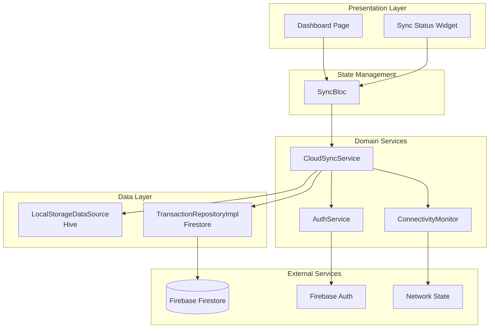
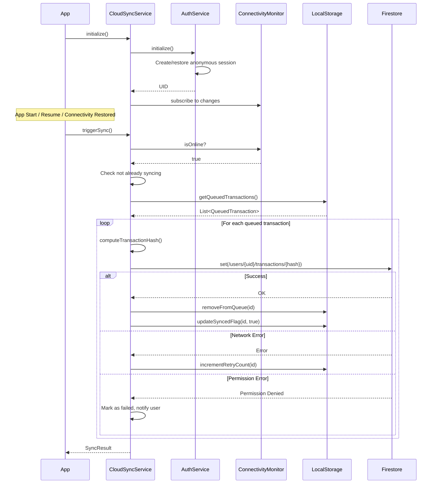
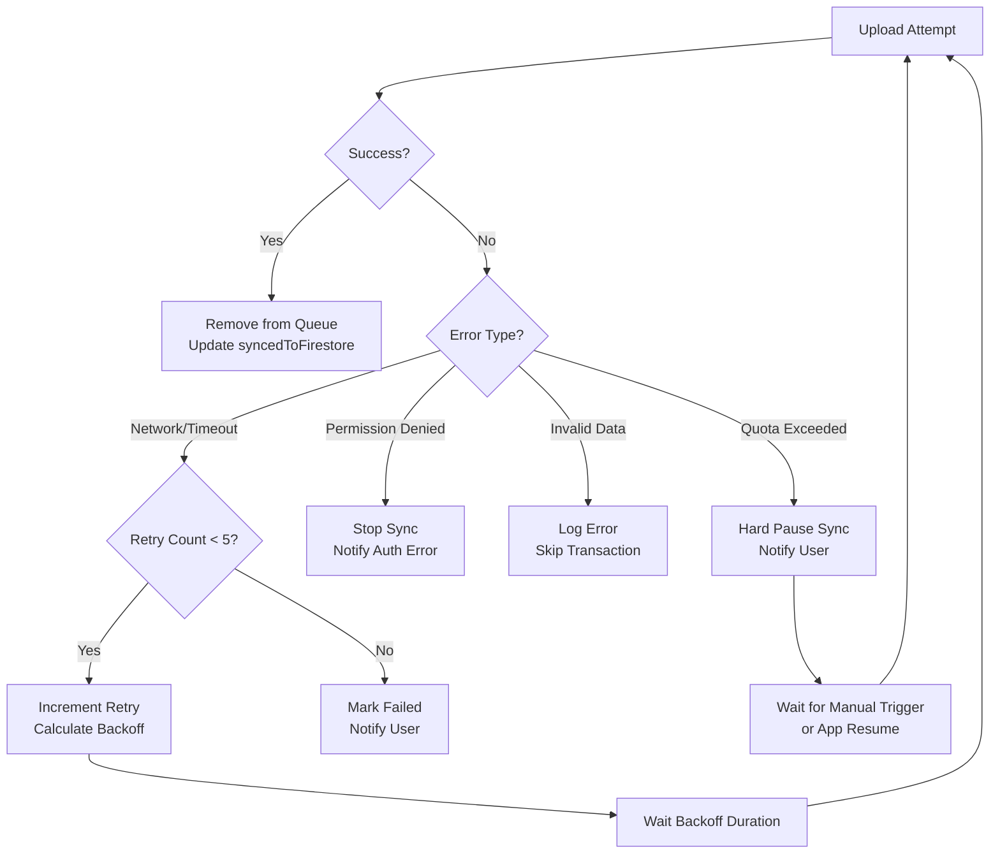

# Design Document: Cloud Transaction Sync

## Overview

This design implements a **production-locked, offline-first, upload-only** synchronization system for uploading locally stored SMS transactions to Firebase Firestore.

### Architecture Principles (NON-NEGOTIABLE)

1. **Local Storage = Source of Truth**: All UI reads come from local Hive DB, never Firestore
2. **Firestore = Backup Mirror**: Cloud is for replication only, not primary storage
3. **Upload-Only Sync**: Sync uploads unsynced transactions, never pulls or deletes
4. **UI Independence**: Sync status affects only icons/badges, never transaction visibility
5. **Idempotent Writes**: Hash-based document IDs prevent duplicates in Firestore

### Pipeline Flow
```
SMS received → parse transaction → store locally (SOURCE OF TRUTH)
            → if internet available → upload to Firestore
            → mark as synced → KEEP local data permanently
```

The system integrates with the existing `LocalStorageDataSource` (Hive-based) and `TransactionRepositoryImpl` (Firestore) components, adding a coordinating `CloudSyncService` that manages the sync lifecycle.

## Architecture



## Components and Interfaces

### 1. CloudSyncService

The central coordinator for all sync operations. Manages sync triggers, queue processing, and status reporting.

**CRITICAL CONSTRAINTS:**
- MUST only upload transactions where `syncedToFirestore == false`
- MUST NOT delete local transactions after successful upload
- MUST NOT pull or overwrite local data from Firestore
- MUST NOT trigger UI refresh on sync completion

```dart
/// Service responsible for coordinating transaction sync between local storage and Firestore
class CloudSyncService {
  final LocalStorageDataSource localStorage;
  final TransactionRepositoryImpl firestoreRepo;
  final AuthService authService;
  final ConnectivityMonitor connectivityMonitor;
  
  /// Current sync state
  SyncState _syncState = SyncState.idle;
  
  /// Stream controller for sync status updates
  final StreamController<SyncStatus> _statusController;
  
  /// Maximum retry attempts per transaction
  static const int maxRetries = 5;
  
  /// Initialize and start monitoring for sync triggers
  Future<void> initialize();
  
  /// Trigger sync (called on app start, resume, connectivity change)
  Future<SyncResult> triggerSync();
  
  /// Manual sync triggered by user
  Future<SyncResult> manualSync();
  
  /// Queue a transaction for sync (called when transaction is saved locally)
  Future<void> queueForSync(Transaction transaction);
  
  /// Get current sync status stream
  Stream<SyncStatus> get statusStream;
  
  /// Get pending transaction count
  Future<int> getPendingCount();
  
  /// Dispose resources
  void dispose();
}

enum SyncState { idle, syncing, paused, error }

/// Sync State Machine - Allowed Transitions
/// 
/// | From     | To       | Condition                    |
/// |----------|----------|------------------------------|
/// | idle     | syncing  | triggerSync & online         |
/// | syncing  | idle     | queue empty (success)        |
/// | syncing  | paused   | connectivity lost            |
/// | syncing  | error    | fatal error (auth/quota)     |
/// | paused   | syncing  | connectivity restored        |
/// | paused   | idle     | manual cancel                |
/// | error    | idle     | manual retry or app resume   |
/// 
/// Invalid transitions (must be prevented):
/// - idle → paused (can't pause what isn't running)
/// - syncing → syncing (no double sync starts)
/// - error → syncing (must go through idle first)

class SyncStatus {
  final SyncState state;
  final int pendingCount;
  final int syncedCount;
  final int failedCount;
  final String? errorMessage;
  final DateTime? lastSyncTime;
}

class SyncResult {
  final int successCount;
  final int failureCount;
  final List<SyncError> errors;
  final bool wasInterrupted;
}

class SyncError {
  final String transactionId;
  final String errorMessage;
  final bool isRetryable;
}
```

### 2. AuthService

Manages Firebase Anonymous Authentication and UID persistence.

```dart
/// Service for managing Firebase Anonymous Authentication
class AuthService {
  final FirebaseAuth _firebaseAuth;
  
  /// Current authenticated user ID (anonymous UID)
  String? _currentUid;
  
  /// Initialize auth - creates anonymous session if needed
  Future<String> initialize();
  
  /// Get current UID (throws if not authenticated)
  String get currentUid;
  
  /// Check if user is authenticated
  bool get isAuthenticated;
  
  /// Sign out (for testing/reset purposes)
  Future<void> signOut();
  
  /// Stream of auth state changes
  Stream<String?> get authStateChanges;
}
```

### 3. ConnectivityMonitor

Monitors network state and notifies sync service of connectivity changes.

```dart
/// Monitor for network connectivity changes
class ConnectivityMonitor {
  final Connectivity _connectivity;
  
  /// Stream of connectivity state changes
  Stream<ConnectivityState> get connectivityStream;
  
  /// Current connectivity state
  Future<ConnectivityState> get currentState;
  
  /// Check if currently online
  Future<bool> get isOnline;
  
  /// Dispose resources
  void dispose();
}

enum ConnectivityState { 
  offline, 
  wifi, 
  mobile, 
  ethernet 
}
```

### 4. SyncBloc

BLoC for managing sync state in the UI layer.

```dart
/// Events for SyncBloc
abstract class SyncEvent {}

class SyncStarted extends SyncEvent {}
class SyncRequested extends SyncEvent {}  // Manual sync
class SyncStatusChanged extends SyncEvent {
  final SyncStatus status;
}
class ConnectivityChanged extends SyncEvent {
  final ConnectivityState state;
}

/// States for SyncBloc
abstract class SyncBlocState {}

class SyncInitial extends SyncBlocState {}
class SyncInProgress extends SyncBlocState {
  final int pendingCount;
}
class SyncComplete extends SyncBlocState {
  final int syncedCount;
  final DateTime lastSyncTime;
}
class SyncPending extends SyncBlocState {
  final int pendingCount;
}
class SyncError extends SyncBlocState {
  final String message;
  final int pendingCount;
}
class SyncOffline extends SyncBlocState {
  final int pendingCount;
}
```

## Data Models

### Transaction Hash Computation

The transaction hash serves as the Firestore document ID for cloud-side deduplication.

**CRITICAL: Hash input fields MUST be normalized before hashing to prevent duplicate cloud documents from parsing variations.**

```dart
/// Compute unique hash for transaction deduplication
/// 
/// Normalization rules:
/// - amount: Fixed 2 decimal places (e.g., "1500.00")
/// - date: ISO 8601 format (YYYY-MM-DD)
/// - time: 24-hour format with seconds (HH:MM:SS)
/// - accountNumber: Uppercase, trimmed, null becomes empty string
/// - smsContent: Trimmed, normalized whitespace (multiple spaces → single space)
String computeTransactionHash(Transaction transaction) {
  // Normalize amount to 2 decimal places
  final normalizedAmount = transaction.amount.toStringAsFixed(2);
  
  // Normalize date to ISO 8601 (YYYY-MM-DD)
  final normalizedDate = transaction.date.trim();
  
  // Normalize time to HH:MM:SS
  final normalizedTime = transaction.time.trim();
  
  // Normalize account number
  final normalizedAccount = (transaction.accountNumber ?? '').trim().toUpperCase();
  
  // Normalize SMS content - trim and collapse whitespace
  final normalizedSms = transaction.smsContent.trim().replaceAll(RegExp(r'\s+'), ' ');
  
  final data = '$normalizedAmount|$normalizedDate|$normalizedTime|$normalizedAccount|$normalizedSms';
  
  final bytes = utf8.encode(data);
  final digest = sha256.convert(bytes);
  return digest.toString();
}
```

### Firestore Document Structure

```
/users/{uid}/transactions/{transactionHash}
{
  "amount": 1500.00,
  "transactionType": "debit",
  "accountNumber": "XXXX1234",
  "date": "2026-01-06",
  "time": "14:30:00",
  "smsContent": "Rs.1500 debited from A/c XXXX1234...",
  "senderPhoneNumber": "VM-HDFCBK",
  "confidenceScore": 0.95,
  "createdAt": Timestamp,
  "duplicateCheckHash": "abc123...",
  "isManualEntry": false,
  "localId": "uuid-v4-local-id",
  "syncedAt": Timestamp
}
```

### Offline Queue Entry

```dart
/// Extended queue entry with retry metadata
class QueuedTransaction {
  final Transaction transaction;
  final int retryCount;
  final DateTime queuedAt;
  final DateTime? lastAttemptAt;
  final String? lastError;
  
  bool get canRetry => retryCount < CloudSyncService.maxRetries;
  
  Duration get backoffDuration {
    // Exponential backoff: 1s, 2s, 4s, 8s, 16s
    return Duration(seconds: 1 << retryCount);
  }
}
```

## Sync Flow Sequence




## Error Handling

### Error Categories

| Error Type | Retryable | Action |
|------------|-----------|--------|
| Network timeout | Yes | Exponential backoff retry |
| Connection lost | Yes | Pause sync, resume on reconnect |
| Firestore unavailable | Yes | Exponential backoff retry |
| Permission denied | No | Stop sync, notify user, require re-auth |
| Unauthenticated | No | Re-initialize auth, then retry |
| Invalid data | No | Log error, skip transaction, notify user |
| Quota exceeded | No* | Hard pause sync until manual trigger or next app resume |

*Quota exceeded is technically retryable but requires a hard pause to prevent re-triggering.

### Exponential Backoff Strategy

```dart
Duration calculateBackoff(int retryCount) {
  // Base delay: 1 second
  // Max delay: 32 seconds (after 5 retries)
  final seconds = min(1 << retryCount, 32);
  // Add jitter to prevent thundering herd
  final jitter = Random().nextInt(1000);
  return Duration(seconds: seconds, milliseconds: jitter);
}
```

### Error Recovery Flow



## Testing Strategy

### Unit Tests

Unit tests verify specific component behaviors:

1. **AuthService Tests**
   - Anonymous auth session creation
   - UID persistence across restarts
   - Auth state change handling

2. **ConnectivityMonitor Tests**
   - Connectivity state detection
   - State change stream emissions

3. **CloudSyncService Tests**
   - Sync trigger conditions (startup, resume, connectivity)
   - Queue processing order (chronological)
   - Retry count management
   - Sync state transitions

4. **Transaction Hash Tests**
   - Hash computation consistency
   - Hash uniqueness for different transactions

### Property-Based Tests

Property-based tests verify universal properties across all inputs using the `dart_check` library.


## Correctness Properties

*A property is a characteristic or behavior that should hold true across all valid executions of a system—essentially, a formal statement about what the system should do. Properties serve as the bridge between human-readable specifications and machine-verifiable correctness guarantees.*

### Property 1: Queue on Save
*For any* valid transaction saved to local storage, the transaction SHALL appear in the offline queue with `syncedToFirestore = false`.
**Validates: Requirements 1.1**

### Property 2: Connectivity Triggers Sync
*For any* connectivity state change from offline to online, when not already syncing, the sync service SHALL initiate a sync operation.
**Validates: Requirements 1.4, 5.2**

### Property 3: Successful Upload Updates Flag
*For any* transaction successfully uploaded to Firestore, the local transaction's `syncedToFirestore` flag SHALL be updated to `true` and the transaction SHALL be removed from the offline queue.
**Validates: Requirements 1.5**

### Property 4: Failed Upload Retains in Queue
*For any* transaction upload that fails due to a retryable error, the transaction SHALL remain in the offline queue with an incremented retry count.
**Validates: Requirements 1.6**

### Property 5: Chronological Upload Order
*For any* set of queued transactions, the sync service SHALL process them in chronological order based on `createdAt` timestamp (oldest first).
**Validates: Requirements 1.7**

### Property 6: Offline Transactions Queued
*For any* transaction saved while the device is offline, the transaction SHALL be stored in the offline queue.
**Validates: Requirements 2.1**

### Property 7: Queue Deduplication (Idempotence)
*For any* transaction, queueing it multiple times SHALL result in exactly one entry in the offline queue (based on transaction ID).
**Validates: Requirements 2.4**

### Property 8: Manual Sync Processes All
*For any* manual sync trigger, the sync service SHALL attempt to upload all queued transactions and return a result containing accurate success and failure counts.
**Validates: Requirements 4.1, 4.2**

### Property 9: No Concurrent Syncs
*For any* sync request while a sync is already in progress, the sync service SHALL reject the request and not start a duplicate sync operation.
**Validates: Requirements 4.3**

### Property 10: Graceful Pause on Connectivity Loss
*For any* sync operation interrupted by connectivity loss, the sync service SHALL pause processing and resume from the next unprocessed transaction when connectivity returns.
**Validates: Requirements 5.3**

### Property 11: Exponential Backoff on Retry
*For any* transaction upload that fails with a retryable error, the next retry attempt SHALL be delayed by an exponentially increasing duration (2^retryCount seconds, capped at 32 seconds).
**Validates: Requirements 6.1**

### Property 12: Max Retry Limit
*For any* transaction, the retry count SHALL not exceed 5. When the limit is reached, the transaction SHALL be marked as permanently failed.
**Validates: Requirements 6.2, 6.3**

### Property 13: No Retry on Permission Error
*For any* transaction upload that fails with a permission denied error, the sync service SHALL NOT retry and SHALL mark the transaction as failed immediately.
**Validates: Requirements 6.4**

### Property 14: Hash as Document ID
*For any* transaction uploaded to Firestore, the document ID SHALL equal the computed transaction hash, and the document path SHALL be `/users/{uid}/transactions/{transactionHash}`.
**Validates: Requirements 7.1, 7.2**

### Property 15: Upsert on Duplicate Hash
*For any* transaction with a hash matching an existing Firestore document, the upload SHALL use `set(..., SetOptions(merge: true))` to update the existing document rather than creating a duplicate.
**Validates: Requirements 7.3**

### Property 16: All Fields Preserved (Round-Trip)
*For any* transaction uploaded to Firestore, all transaction fields (amount, transactionType, accountNumber, date, time, smsContent, senderPhoneNumber, confidenceScore, createdAt, duplicateCheckHash, isManualEntry) SHALL be preserved without data loss.
**Validates: Requirements 7.4**

### Property 17: Transaction Validation Before Upload
*For any* transaction, the sync service SHALL validate required fields (amount, date, time, smsContent, senderPhoneNumber) are present and valid before attempting upload.
**Validates: Requirements 7.5**

### Property 18: Deterministic Hash Computation
*For any* transaction, computing the hash multiple times with the same field values (amount, date, time, accountNumber, smsContent) SHALL produce the same hash value.
**Validates: Requirements 7.6**

### Property 19: UID Persistence
*For any* app restart, the Anonymous Auth UID SHALL remain the same as the previous session.
**Validates: Requirements 8.2**

### Property 20: Auth UID as UserId
*For any* transaction uploaded to Firestore, the userId field SHALL equal the current Anonymous Auth UID.
**Validates: Requirements 8.3**

### Property 21: Local-Only Fallback
*For any* Anonymous Auth failure, the system SHALL operate in local-only mode, storing transactions locally without attempting cloud sync.
**Validates: Requirements 8.6**

## Integration with Existing Code

### Modified Files

1. **`lib/core/services/service_locator.dart`**
   - Register `CloudSyncService`, `AuthService`, `ConnectivityMonitor`
   - Initialize services on app startup

2. **`lib/data/repositories/local_transaction_repository.dart`**
   - Add call to `CloudSyncService.queueForSync()` after saving transaction

3. **`lib/main.dart`**
   - Initialize `AuthService` before other services
   - Start `CloudSyncService` monitoring
   - Add app lifecycle observer for resume trigger

4. **`lib/presentation/pages/dashboard_page.dart`**
   - Add sync status indicator widget
   - Add manual sync button

5. **`lib/presentation/bloc/transaction_bloc.dart`**
   - Integrate with `SyncBloc` for status updates

### New Files

1. **`lib/core/services/cloud_sync_service.dart`** - Main sync coordinator
2. **`lib/core/services/auth_service.dart`** - Firebase Anonymous Auth wrapper
3. **`lib/core/services/connectivity_monitor.dart`** - Network state monitor
4. **`lib/presentation/bloc/sync_bloc.dart`** - Sync state management
5. **`lib/presentation/widgets/sync_status_widget.dart`** - UI indicator
6. **`lib/core/utils/transaction_hash.dart`** - Hash computation utility

### Firestore Security Rules

```javascript
rules_version = '2';
service cloud.firestore {
  match /databases/{database}/documents {
    match /users/{userId}/transactions/{transactionId} {
      // Allow read/write only if the request is from the owning user
      allow read, write: if request.auth != null && request.auth.uid == userId;
    }
  }
}
```
