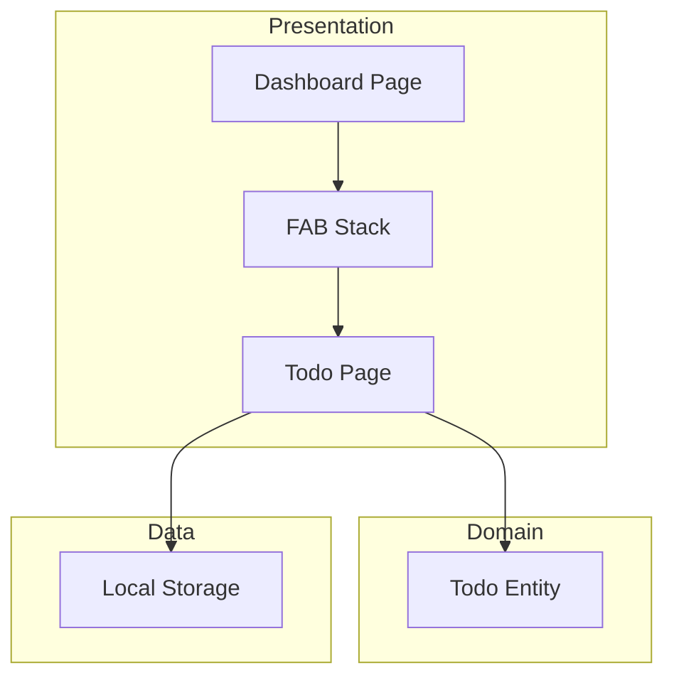

# Design Document: Simple Todo List

## Overview

This design describes a simple todo list feature for the PayLog Flutter app. The feature adds a floating action button (FAB) stack on the dashboard with a todo icon above the existing manual entry button. Tapping the todo button navigates to a dedicated todo list page where users can add, complete, and delete tasks with local persistence.

## Architecture

The feature follows the existing app architecture:
- **Presentation Layer**: Todo page UI, FAB stack on dashboard
- **Domain Layer**: Todo item entity
- **Data Layer**: Local storage for persistence using SharedPreferences



## Components and Interfaces

### 1. Todo Entity

```dart
class TodoItem {
  final String id;
  final String description;
  final bool isCompleted;
  final DateTime createdAt;
  
  TodoItem({
    required this.id,
    required this.description,
    this.isCompleted = false,
    required this.createdAt,
  });
  
  TodoItem copyWith({
    String? id,
    String? description,
    bool? isCompleted,
    DateTime? createdAt,
  });
  
  Map<String, dynamic> toJson();
  factory TodoItem.fromJson(Map<String, dynamic> json);
}
```

### 2. Todo Storage Service

```dart
abstract class TodoStorageService {
  Future<List<TodoItem>> loadTodos();
  Future<void> saveTodos(List<TodoItem> todos);
  Future<void> addTodo(TodoItem todo);
  Future<void> updateTodo(TodoItem todo);
  Future<void> deleteTodo(String id);
}
```

### 3. Todo Page Widget

```dart
class TodoPage extends StatefulWidget {
  // Manages local state for todo list
  // Handles add, toggle, delete operations
  // Persists changes to local storage
}
```

### 4. Dashboard FAB Stack

The dashboard will use a `Column` with two `FloatingActionButton` widgets:
- Top: Todo button (checklist icon)
- Bottom: Existing manual entry button

## Data Models

### TodoItem JSON Schema

```json
{
  "id": "string (UUID)",
  "description": "string",
  "isCompleted": "boolean",
  "createdAt": "string (ISO 8601)"
}
```

### Storage Key
- SharedPreferences key: `todo_items`
- Value: JSON array of TodoItem objects

## Correctness Properties

*A property is a characteristic or behavior that should hold true across all valid executions of a system—essentially, a formal statement about what the system should do. Properties serve as the bridge between human-readable specifications and machine-verifiable correctness guarantees.*

### Property 1: Adding valid task increases list size

*For any* todo list and *for any* valid (non-empty, non-whitespace) task description, adding that task to the list should result in the list length increasing by exactly one, and the new item should be present in the list.

**Validates: Requirements 3.1**

### Property 2: Whitespace-only tasks are rejected

*For any* string composed entirely of whitespace characters (including empty string), attempting to add it as a task should be rejected, and the todo list should remain unchanged.

**Validates: Requirements 3.2**

### Property 3: Toggle flips completion status

*For any* todo item in the list, toggling its completion status should flip the `isCompleted` boolean (true becomes false, false becomes true), while preserving all other item properties.

**Validates: Requirements 4.1**

### Property 4: Delete removes item from list

*For any* todo list containing at least one item, and *for any* item in that list, deleting that item should reduce the list length by exactly one, and the deleted item should no longer be present in the list.

**Validates: Requirements 5.1**

### Property 5: Persistence round-trip

*For any* sequence of todo operations (add, toggle, delete), saving the resulting list to storage and then loading it back should produce an equivalent list with the same items, completion states, and order.

**Validates: Requirements 6.1, 6.2**

### Property 6: TodoItem JSON serialization round-trip

*For any* valid TodoItem, serializing to JSON and deserializing back should produce an equivalent TodoItem with identical id, description, isCompleted, and createdAt values.

**Validates: Requirements 6.1**

## Error Handling

| Error Scenario | Handling Strategy |
|----------------|-------------------|
| Empty/whitespace task input | Show inline validation message, prevent submission |
| Storage read failure | Show error message, initialize with empty list |
| Storage write failure | Show snackbar error, retry on next operation |
| Invalid JSON in storage | Log error, initialize with empty list |

## Testing Strategy

### Unit Tests
- TodoItem entity: constructor, copyWith, equality
- JSON serialization/deserialization edge cases
- Input validation logic (empty, whitespace, valid strings)

### Property-Based Tests
Using `fast_check` or similar Dart PBT library:
- Property 1: Add valid task (generate random valid strings)
- Property 2: Whitespace rejection (generate whitespace-only strings)
- Property 3: Toggle completion (generate random todo items)
- Property 4: Delete item (generate random lists with items)
- Property 5: Persistence round-trip (generate random operation sequences)
- Property 6: JSON round-trip (generate random TodoItem instances)

Each property test should run minimum 100 iterations.

### Widget Tests
- FAB stack layout on dashboard
- Navigation to todo page
- Empty state display
- Todo item rendering with checkbox
- Strikethrough styling for completed items
- Swipe-to-delete gesture
