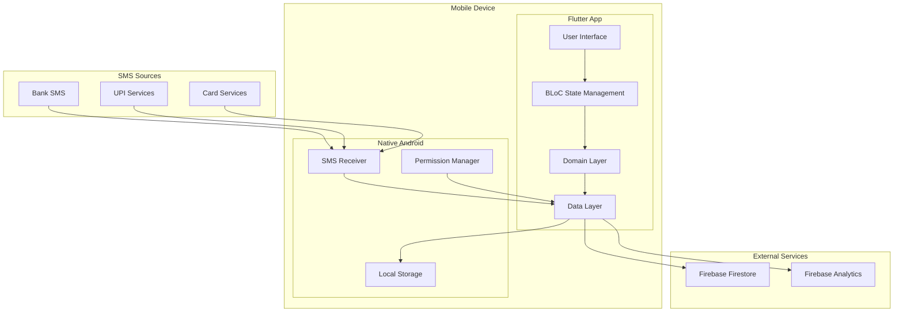
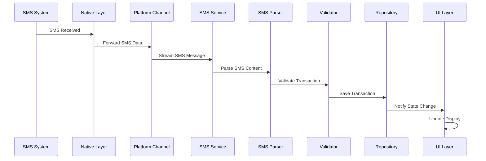
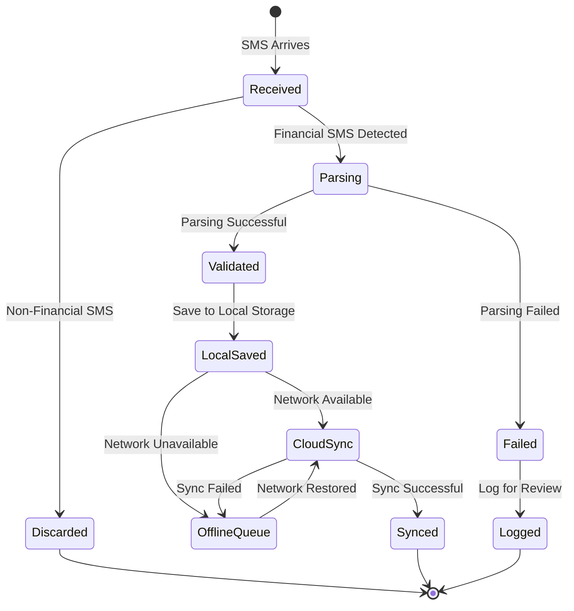
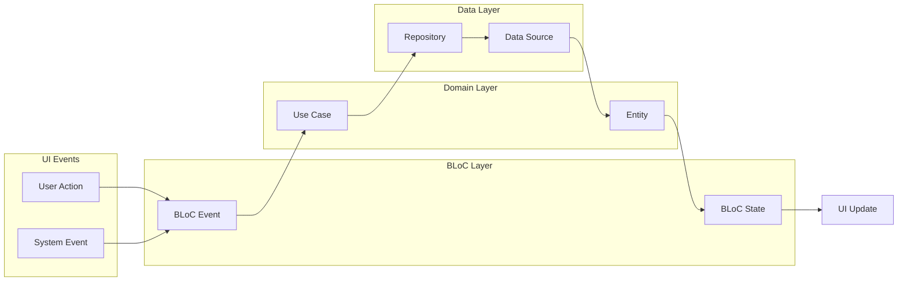

# PayLog - Architecture & System Design Documentation

## Overview

PayLog is built using **Clean Architecture** principles with **Flutter** as the presentation layer. The system follows a layered approach that separates concerns, ensures testability, and provides flexibility for future enhancements.

## Architectural Principles

### 1. Clean Architecture

The application follows Uncle Bob's Clean Architecture pattern:

```
┌─────────────────────────────────────────────────────────────┐
│                    Presentation Layer                        │
│  ┌─────────────┐  ┌─────────────┐  ┌─────────────────────┐  │
│  │   Pages     │  │   BLoCs     │  │      Widgets        │  │
│  └─────────────┘  └─────────────┘  └─────────────────────┘  │
└─────────────────────────────────────────────────────────────┘
                              │
┌─────────────────────────────────────────────────────────────┐
│                     Domain Layer                            │
│  ┌─────────────┐  ┌─────────────┐  ┌─────────────────────┐  │
│  │  Entities   │  │ Use Cases   │  │   Repositories      │  │
│  │             │  │             │  │   (Interfaces)      │  │
│  └─────────────┘  └─────────────┘  └─────────────────────┘  │
└─────────────────────────────────────────────────────────────┘
                              │
┌─────────────────────────────────────────────────────────────┐
│                      Data Layer                             │
│  ┌─────────────┐  ┌─────────────┐  ┌─────────────────────┐  │
│  │ Repositories│  │ Data Sources│  │   Platform APIs     │  │
│  │ (Concrete)  │  │             │  │                     │  │
│  └─────────────┘  └─────────────┘  └─────────────────────┘  │
└─────────────────────────────────────────────────────────────┘
```

### 2. Dependency Inversion

- High-level modules don't depend on low-level modules
- Both depend on abstractions (interfaces)
- Abstractions don't depend on details
- Details depend on abstractions

### 3. Single Responsibility

Each class and module has a single, well-defined responsibility:
- **Entities**: Business objects and rules
- **Use Cases**: Application-specific business rules
- **Repositories**: Data access abstraction
- **Data Sources**: External data handling
- **BLoCs**: UI state management

## System Architecture

### High-Level System Design



## Layer-by-Layer Architecture

### 1. Presentation Layer

**Responsibility**: User interface and user interaction handling

#### Components

**Pages/Screens**
```dart
lib/presentation/pages/
├── dashboard_page.dart          # Main dashboard
├── transaction_details_page.dart # Transaction details
├── manual_entry_page.dart       # Manual transaction entry
├── settings_page.dart           # App settings
└── onboarding_page.dart         # First-time user setup
```

**BLoCs (Business Logic Components)**
```dart
lib/presentation/bloc/
├── sms_bloc.dart               # SMS monitoring state
├── transaction_bloc.dart       # Transaction management state
├── settings_bloc.dart          # App settings state
└── onboarding_bloc.dart        # Onboarding flow state
```

**Widgets**
```dart
lib/presentation/widgets/
├── transaction_card.dart       # Transaction display card
├── status_indicator.dart       # Service status indicator
├── empty_state.dart           # Empty state displays
├── loading_indicator.dart     # Loading states
└── error_display.dart         # Error state displays
```

#### State Management Pattern

**BLoC Pattern Implementation**
```dart
// Event-driven state management
abstract class TransactionEvent {}
class LoadTransactions extends TransactionEvent {}
class AddTransaction extends TransactionEvent {
  final Transaction transaction;
  AddTransaction(this.transaction);
}

abstract class TransactionState {}
class TransactionInitial extends TransactionState {}
class TransactionLoading extends TransactionState {}
class TransactionLoaded extends TransactionState {
  final List<Transaction> transactions;
  TransactionLoaded(this.transactions);
}
class TransactionError extends TransactionState {
  final String message;
  TransactionError(this.message);
}

class TransactionBloc extends Bloc<TransactionEvent, TransactionState> {
  final TransactionRepository repository;
  
  TransactionBloc({required this.repository}) : super(TransactionInitial()) {
    on<LoadTransactions>(_onLoadTransactions);
    on<AddTransaction>(_onAddTransaction);
  }
  
  Future<void> _onLoadTransactions(
    LoadTransactions event,
    Emitter<TransactionState> emit,
  ) async {
    emit(TransactionLoading());
    try {
      final transactions = await repository.getAllTransactions();
      emit(TransactionLoaded(transactions));
    } catch (e) {
      emit(TransactionError(e.toString()));
    }
  }
}
```

### 2. Domain Layer

**Responsibility**: Business logic and rules, independent of external concerns

#### Entities

**Core Business Objects**
```dart
lib/domain/entities/
├── transaction.dart            # Transaction entity
├── sms_message.dart           # SMS message entity
├── transaction_type.dart      # Transaction type enum
├── user.dart                  # User entity
└── parsing_result.dart        # SMS parsing result
```

**Entity Characteristics**
- Immutable data structures
- Business rule validation
- No external dependencies
- JSON serializable for persistence

#### Use Cases

**Business Logic Operations**
```dart
lib/domain/usecases/
├── parse_sms_transaction.dart     # SMS parsing logic
├── detect_financial_context.dart # Financial SMS detection
├── validate_transaction.dart      # Transaction validation
├── sync_offline_queue.dart        # Offline synchronization
├── manage_duplicates.dart         # Duplicate detection
└── export_transactions.dart       # Data export functionality
```

**Use Case Pattern**
```dart
abstract class UseCase<Type, Params> {
  Future<Type> call(Params params);
}

class ParseSmsTransaction extends UseCase<ParsedTransaction?, SmsMessage> {
  final FinancialContextDetector detector;
  
  ParseSmsTransaction(this.detector);
  
  @override
  Future<ParsedTransaction?> call(SmsMessage sms) async {
    // Business logic implementation
    if (!detector.isFinancialMessage(sms.content)) {
      return null;
    }
    
    // Parse transaction details
    return _parseTransactionDetails(sms);
  }
}
```

#### Repository Interfaces

**Data Access Abstractions**
```dart
lib/domain/repositories/
├── transaction_repository.dart    # Transaction data operations
├── sms_repository.dart           # SMS data operations
├── user_repository.dart          # User data operations
└── settings_repository.dart      # Settings data operations
```

### 3. Data Layer

**Responsibility**: Data access, external API communication, and data persistence

#### Repository Implementations

**Concrete Repository Classes**
```dart
lib/data/repositories/
├── transaction_repository_impl.dart    # Firebase + Local implementation
├── local_transaction_repository.dart   # Local-only implementation
├── sms_repository_impl.dart           # SMS data implementation
└── settings_repository_impl.dart      # Settings implementation
```

**Repository Pattern Implementation**
```dart
class TransactionRepositoryImpl implements TransactionRepository {
  final LocalStorageDataSource localStorage;
  final FirestoreDataSource firestore;
  final ConnectivityService connectivity;
  
  TransactionRepositoryImpl({
    required this.localStorage,
    required this.firestore,
    required this.connectivity,
  });
  
  @override
  Future<void> saveTransaction(Transaction transaction) async {
    // Always save locally first
    await localStorage.saveTransaction(transaction);
    
    // Sync to cloud if connected
    if (await connectivity.isConnected()) {
      try {
        await firestore.saveTransaction(transaction);
        // Mark as synced
        await localStorage.markAsSynced(transaction.id);
      } catch (e) {
        // Add to offline queue for later sync
        await localStorage.addToOfflineQueue(transaction);
      }
    } else {
      // Add to offline queue
      await localStorage.addToOfflineQueue(transaction);
    }
  }
  
  @override
  Stream<List<Transaction>> watchTransactions() {
    // Combine local and remote streams
    return StreamGroup.merge([
      localStorage.watchTransactions(),
      firestore.watchTransactions(),
    ]).distinct();
  }
}
```

#### Data Sources

**External Data Access**
```dart
lib/data/datasources/
├── sms_platform_channel.dart         # Native SMS access
├── local_storage_datasource.dart     # Hive local storage
├── firestore_datasource.dart         # Firebase Firestore
├── connectivity_datasource.dart      # Network connectivity
└── permissions_datasource.dart       # Device permissions
```

**Data Source Characteristics**
- Single responsibility (one external system each)
- Error handling and retry logic
- Caching strategies
- Connection management

#### Platform Channels

**Native Platform Integration**
```dart
// SMS Platform Channel Architecture
┌─────────────────┐    ┌─────────────────┐    ┌─────────────────┐
│   Flutter App   │    │ Platform Channel│    │  Native Android │
│                 │    │                 │    │                 │
│ SmsPlatformCh.. │◄──►│ MethodChannel   │◄──►│ SmsReceiver     │
│                 │    │ EventChannel    │    │ PermissionMgr   │
└─────────────────┘    └─────────────────┘    └─────────────────┘
```

**Method Channel Implementation**
```dart
class SmsPlatformChannel {
  static const MethodChannel _methodChannel = 
      MethodChannel('flutter_sms_parser/methods');
  static const EventChannel _eventChannel = 
      EventChannel('flutter_sms_parser/sms_stream');
  
  // Bidirectional communication
  Future<bool> requestPermissions() async {
    return await _methodChannel.invokeMethod('requestPermissions');
  }
  
  Stream<SmsMessage> get smsStream {
    return _eventChannel.receiveBroadcastStream()
        .map((event) => SmsMessage.fromMap(event));
  }
}
```

## Core Services

### 1. Service Locator (Dependency Injection)

**Centralized Service Management**
```dart
class ServiceLocator {
  final Map<Type, dynamic> _services = {};
  
  // Service registration
  void register<T>(T service) {
    _services[T] = service;
  }
  
  // Service retrieval
  T get<T>() {
    final service = _services[T];
    if (service == null) {
      throw StateError('Service of type $T is not registered');
    }
    return service as T;
  }
  
  // Initialization with dependency graph
  Future<void> initialize() async {
    // Initialize in dependency order
    await _initializeCoreServices();
    await _initializeDataSources();
    _initializeRepositories();
    _initializeUseCases();
    await _initializeApplicationServices();
  }
}
```

### 2. Background Services

**SMS Monitoring Service**
```dart
class BackgroundSmsService {
  static const String _isolateName = 'sms_background_isolate';
  
  static Future<bool> startBackgroundMonitoring() async {
    // Create background isolate for SMS processing
    final isolate = await Isolate.spawn(
      _backgroundSmsHandler,
      _isolateName,
    );
    
    // Register isolate for background execution
    return await _registerBackgroundTask(isolate);
  }
  
  static void _backgroundSmsHandler(String isolateName) {
    // Background SMS processing logic
    // Runs independently of main app lifecycle
  }
}
```

### 3. Offline Support Architecture

**Multi-layered Offline Strategy**
```
┌─────────────────────────────────────────────────────────────┐
│                    Application Layer                        │
└─────────────────────────────────────────────────────────────┘
                              │
┌─────────────────────────────────────────────────────────────┐
│                   Repository Layer                          │
│  ┌─────────────────┐              ┌─────────────────────┐   │
│  │ Local Storage   │◄────────────►│  Cloud Storage      │   │
│  │ (Primary)       │              │  (Secondary)        │   │
│  └─────────────────┘              └─────────────────────┘   │
└─────────────────────────────────────────────────────────────┘
                              │
┌─────────────────────────────────────────────────────────────┐
│                    Sync Queue Layer                        │
│  ┌─────────────────┐  ┌─────────────────┐  ┌─────────────┐ │
│  │ Pending Queue   │  │ Retry Logic     │  │ Conflict    │ │
│  │                 │  │                 │  │ Resolution  │ │
│  └─────────────────┘  └─────────────────┘  └─────────────┘ │
└─────────────────────────────────────────────────────────────┘
```

**Offline Queue Implementation**
```dart
class OfflineQueueManager {
  final LocalStorageDataSource localStorage;
  final ConnectivityService connectivity;
  
  // Add transaction to offline queue
  Future<void> enqueue(Transaction transaction) async {
    await localStorage.addToOfflineQueue(transaction);
    _scheduleSync();
  }
  
  // Process offline queue when connectivity restored
  Future<void> processQueue() async {
    if (!await connectivity.isConnected()) return;
    
    final pendingTransactions = await localStorage.getOfflineQueue();
    
    for (final transaction in pendingTransactions) {
      try {
        await _syncTransaction(transaction);
        await localStorage.removeFromOfflineQueue(transaction.id);
      } catch (e) {
        // Retry later with exponential backoff
        await _scheduleRetry(transaction);
      }
    }
  }
}
```

## Data Flow Architecture

### 1. SMS Processing Pipeline



### 2. Transaction Lifecycle



### 3. State Management Flow



## Security Architecture

### 1. Data Protection Layers

```
┌─────────────────────────────────────────────────────────────┐
│                    Application Security                     │
│  ┌─────────────────┐  ┌─────────────────┐  ┌─────────────┐ │
│  │ Input Validation│  │ Business Rules  │  │ Output      │ │
│  │                 │  │ Enforcement     │  │ Sanitization│ │
│  └─────────────────┘  └─────────────────┘  └─────────────┘ │
└─────────────────────────────────────────────────────────────┘
                              │
┌─────────────────────────────────────────────────────────────┐
│                     Data Security                           │
│  ┌─────────────────┐  ┌─────────────────┐  ┌─────────────┐ │
│  │ Local Encryption│  │ Secure Storage  │  │ Data        │ │
│  │                 │  │                 │  │ Anonymization│ │
│  └─────────────────┘  └─────────────────┘  └─────────────┘ │
└─────────────────────────────────────────────────────────────┘
                              │
┌─────────────────────────────────────────────────────────────┐
│                   Transport Security                        │
│  ┌─────────────────┐  ┌─────────────────┐  ┌─────────────┐ │
│  │ HTTPS/TLS       │  │ Certificate     │  │ API         │ │
│  │                 │  │ Pinning         │  │ Authentication│ │
│  └─────────────────┘  └─────────────────┘  └─────────────┘ │
└─────────────────────────────────────────────────────────────┘
```

### 2. Permission Management

**Granular Permission Handling**
```dart
class PermissionsService {
  // Check specific permissions
  Future<bool> hasSmsPermissions() async {
    final readSms = await Permission.sms.status;
    final receiveSms = await Permission.sms.status;
    return readSms.isGranted && receiveSms.isGranted;
  }
  
  // Request permissions with user education
  Future<bool> requestSmsPermissions() async {
    // Show permission rationale
    await _showPermissionRationale();
    
    // Request permissions
    final result = await [
      Permission.sms,
      Permission.receiveSms,
    ].request();
    
    return result.values.every((status) => status.isGranted);
  }
  
  // Handle permission denial gracefully
  Future<void> handlePermissionDenied() async {
    // Offer alternative functionality
    await _showManualEntryOption();
  }
}
```

### 3. Data Privacy

**Privacy-First Design**
```dart
class PrivacyManager {
  // Only process financial SMS
  bool shouldProcessSms(String content) {
    return FinancialContextDetector.isFinancialMessage(content);
  }
  
  // Anonymize sensitive data
  String anonymizeAccountNumber(String accountNumber) {
    if (accountNumber.length <= 4) return accountNumber;
    return 'XXXX${accountNumber.substring(accountNumber.length - 4)}';
  }
  
  // Secure data deletion
  Future<void> secureDelete(String transactionId) async {
    // Overwrite data multiple times
    await _overwriteData(transactionId);
    await _removeFromAllCaches(transactionId);
    await _clearFromBackups(transactionId);
  }
}
```

## Performance Architecture

### 1. Optimization Strategies

**Multi-level Caching**
```
┌─────────────────────────────────────────────────────────────┐
│                      UI Cache                               │
│  ┌─────────────────┐  ┌─────────────────┐  ┌─────────────┐ │
│  │ Widget Cache    │  │ Image Cache     │  │ State Cache │ │
│  └─────────────────┘  └─────────────────┘  └─────────────┘ │
└─────────────────────────────────────────────────────────────┘
                              │
┌─────────────────────────────────────────────────────────────┐
│                   Application Cache                         │
│  ┌─────────────────┐  ┌─────────────────┐  ┌─────────────┐ │
│  │ Query Results   │  │ Parsed Data     │  │ User        │ │
│  │                 │  │                 │  │ Preferences │ │
│  └─────────────────┘  └─────────────────┘  └─────────────┘ │
└─────────────────────────────────────────────────────────────┘
                              │
┌─────────────────────────────────────────────────────────────┐
│                     Data Cache                              │
│  ┌─────────────────┐  ┌─────────────────┐  ┌─────────────┐ │
│  │ Local Database  │  │ Network Cache   │  │ File System │ │
│  │                 │  │                 │  │ Cache       │ │
│  └─────────────────┘  └─────────────────┘  └─────────────┘ │
└─────────────────────────────────────────────────────────────┘
```

### 2. Memory Management

**Resource Lifecycle Management**
```dart
class ResourceManager {
  final Map<String, StreamSubscription> _subscriptions = {};
  final Map<String, Timer> _timers = {};
  
  // Register managed resources
  void registerSubscription(String key, StreamSubscription subscription) {
    _subscriptions[key]?.cancel();
    _subscriptions[key] = subscription;
  }
  
  // Cleanup on disposal
  Future<void> dispose() async {
    // Cancel all subscriptions
    for (final subscription in _subscriptions.values) {
      await subscription.cancel();
    }
    _subscriptions.clear();
    
    // Cancel all timers
    for (final timer in _timers.values) {
      timer.cancel();
    }
    _timers.clear();
  }
}
```

### 3. Background Processing

**Isolate-based Processing**
```dart
class BackgroundProcessor {
  static Future<List<ParsedTransaction>> processSmsInBackground(
    List<SmsMessage> messages,
  ) async {
    // Create compute isolate for heavy processing
    return await compute(_processSmsMessages, messages);
  }
  
  static List<ParsedTransaction> _processSmsMessages(
    List<SmsMessage> messages,
  ) {
    // Heavy processing in background isolate
    final parser = ParseSmsTransaction();
    return messages
        .map((sms) => parser.parseTransaction(sms))
        .where((transaction) => transaction != null)
        .cast<ParsedTransaction>()
        .toList();
  }
}
```

## Testing Architecture

### 1. Testing Strategy

**Pyramid Testing Approach**
```
                    ┌─────────────────┐
                    │   E2E Tests     │ ← Few, High-level
                    │   (Integration) │
                    └─────────────────┘
                  ┌─────────────────────┐
                  │   Widget Tests      │ ← Some, UI Components
                  │   (Component)       │
                  └─────────────────────┘
              ┌─────────────────────────────┐
              │      Unit Tests             │ ← Many, Fast
              │   (Business Logic)          │
              └─────────────────────────────┘
```

### 2. Test Architecture

**Layered Testing Structure**
```dart
test/
├── unit/
│   ├── domain/
│   │   ├── entities/
│   │   └── usecases/
│   ├── data/
│   │   ├── repositories/
│   │   └── datasources/
│   └── core/
│       └── utils/
├── widget/
│   ├── pages/
│   ├── widgets/
│   └── bloc/
├── integration/
│   ├── sms_flow_test.dart
│   ├── offline_sync_test.dart
│   └── end_to_end_test.dart
└── mocks/
    ├── mock_repositories.dart
    ├── mock_datasources.dart
    └── mock_services.dart
```

### 3. Mock Architecture

**Comprehensive Mocking Strategy**
```dart
// Repository mocks
class MockTransactionRepository extends Mock 
    implements TransactionRepository {}

// Data source mocks
class MockSmsPlatformChannel extends Mock 
    implements SmsPlatformChannel {
  @override
  Stream<SmsMessage> get smsStream => Stream.fromIterable([
    SmsMessage(
      sender: 'TEST-BANK',
      content: 'Test transaction Rs.100',
      timestamp: DateTime.now(),
    ),
  ]);
}

// Service mocks
class MockServiceLocator extends ServiceLocator {
  @override
  T get<T>() {
    // Return mock implementations
    if (T == TransactionRepository) {
      return MockTransactionRepository() as T;
    }
    return super.get<T>();
  }
}
```

## Deployment Architecture

### 1. Build Configuration

**Multi-environment Setup**
```dart
// Environment configuration
abstract class Environment {
  static const String dev = 'development';
  static const String staging = 'staging';
  static const String production = 'production';
  
  static String get current {
    return const String.fromEnvironment('ENVIRONMENT', defaultValue: dev);
  }
}

// Environment-specific configurations
class Config {
  static const Map<String, Map<String, dynamic>> _configs = {
    Environment.dev: {
      'apiUrl': 'https://dev-api.paylog.com',
      'enableLogging': true,
      'enableAnalytics': false,
    },
    Environment.production: {
      'apiUrl': 'https://api.paylog.com',
      'enableLogging': false,
      'enableAnalytics': true,
    },
  };
  
  static Map<String, dynamic> get current => 
      _configs[Environment.current] ?? _configs[Environment.dev]!;
}
```

### 2. CI/CD Pipeline

**Automated Build and Deployment**
```yaml
# GitHub Actions workflow
name: Build and Deploy
on:
  push:
    branches: [main, develop]
  pull_request:
    branches: [main]

jobs:
  test:
    runs-on: ubuntu-latest
    steps:
      - uses: actions/checkout@v2
      - uses: subosito/flutter-action@v2
      - run: flutter pub get
      - run: flutter test
      - run: flutter analyze
      
  build:
    needs: test
    runs-on: ubuntu-latest
    steps:
      - uses: actions/checkout@v2
      - uses: subosito/flutter-action@v2
      - run: flutter build apk --release
      - uses: actions/upload-artifact@v2
        with:
          name: release-apk
          path: build/app/outputs/flutter-apk/app-release.apk
```

## Monitoring and Observability

### 1. Logging Architecture

**Structured Logging**
```dart
class Logger {
  static const String _tag = 'PayLog';
  
  static void debug(String message, {Map<String, dynamic>? context}) {
    _log(LogLevel.debug, message, context);
  }
  
  static void error(String message, {Object? error, StackTrace? stackTrace}) {
    _log(LogLevel.error, message, {
      'error': error?.toString(),
      'stackTrace': stackTrace?.toString(),
    });
  }
  
  static void _log(LogLevel level, String message, Map<String, dynamic>? context) {
    final logEntry = {
      'timestamp': DateTime.now().toIso8601String(),
      'level': level.toString(),
      'message': message,
      'tag': _tag,
      if (context != null) ...context,
    };
    
    // Send to appropriate logging service
    _sendToLoggingService(logEntry);
  }
}
```

### 2. Performance Monitoring

**Key Metrics Tracking**
```dart
class PerformanceMonitor {
  static final Map<String, Stopwatch> _timers = {};
  
  static void startTimer(String operation) {
    _timers[operation] = Stopwatch()..start();
  }
  
  static void endTimer(String operation) {
    final timer = _timers.remove(operation);
    if (timer != null) {
      timer.stop();
      _recordMetric(operation, timer.elapsedMilliseconds);
    }
  }
  
  static void _recordMetric(String operation, int durationMs) {
    // Send to analytics service
    FirebaseAnalytics.instance.logEvent(
      name: 'performance_metric',
      parameters: {
        'operation': operation,
        'duration_ms': durationMs,
      },
    );
  }
}
```

## Future Architecture Considerations

### 1. Scalability Enhancements

- **Microservices**: Split into specialized services
- **Event Sourcing**: Implement event-driven architecture
- **CQRS**: Separate read and write operations
- **Distributed Caching**: Multi-level caching strategy

### 2. Technology Evolution

- **Flutter Web**: Extend to web platform
- **Desktop Support**: Windows/macOS/Linux support
- **Wear OS**: Smartwatch companion app
- **IoT Integration**: Smart home financial notifications

### 3. Advanced Features

- **Machine Learning**: Improve parsing accuracy
- **Blockchain**: Secure transaction verification
- **AI Analytics**: Intelligent spending insights
- **Voice Interface**: Voice-controlled operations

The architecture is designed to be flexible, maintainable, and scalable while following industry best practices and clean code principles.